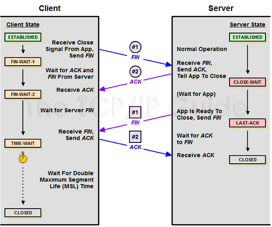
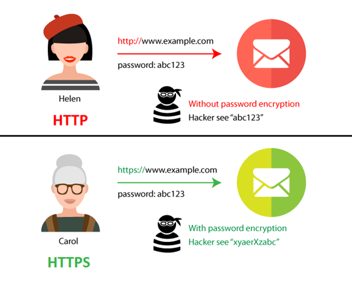
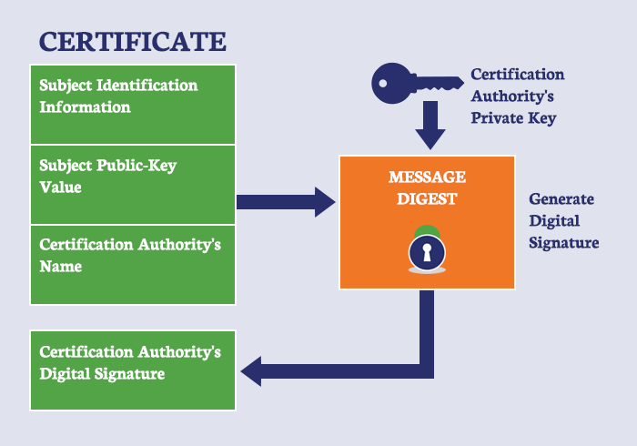
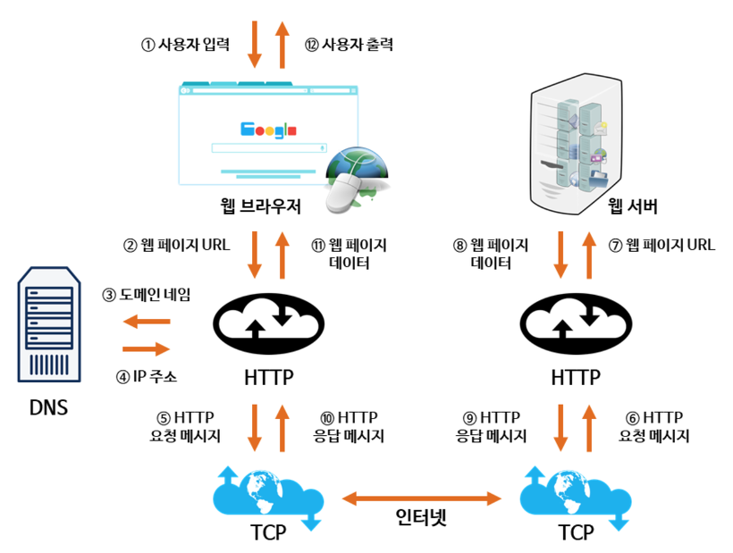

# Network

https://hyonee.tistory.com/136

### 네트워크란?

**물리적 전송 매체**를 사용하여 서로 **연결**된 장치 세트

- **데이터 정보 및 리소스**를 통신하고 공유하기 위해 **서로 연결된 컴퓨터 그룹**
- 노드 둘 이상의 네트워크를 연결하는 데 사용

###### 망 종류

- LAN: 소규모로 연결되는 네트워크 ex) 사무실
- WAN: LAN과 LAN을 연결하는 대규모 네트워크

###### Cast의 종류

유멀브

- 유니캐스트: 1:1 통신
- 멀티캐스트: 1:N 통신
- 브로드캐스트: 1:all 통신 -> 무조건 받아들이는 통신

###### 회선, 대역폭

- 전송되는 데이터를 허용할 수 있는 동시접속자 수

## 계층 구조

### OSI 7계층

통신 접속에서 완료까지의 과정을 7단계로 정의한 국제 통신 표준 규약

물데네전세표응

1. 물리 계층: 네트워크 케이블 재징, 커넥터 형식 등 물리적 요소 규정

   - 전송 단위: 비트

   - 장비: 통신 케이블, 허브

2. 데이터링크 계층: 직접 연결된 기기 사이 논리적인 전송로(데이터링크), MAC Address를 통해 송수신 확인

   - 전송 단위: 프레임

   - 장비: 브릿지, 스위치
   - 프로토콜: 이더넷

3. 네트워크 계층: 패킷을 네트워크 간 **IP**를 통하여 데이터 전달

   - 전송 단위: 패킷

   - 장비: 라우팅
   - 프로토콜: IP, ICMP, ARP

4. 전송 계층: 두 호스트 시스템으로부터 발생하는 데이터 흐름 제공

   - 전송 단위: 세그먼트
   - 장비: TCP/UDP
   - 프로토콜: 게이트, L4 스위치

5. 세션 계층: 데이터를 보내는 **논리적인 통신로**(커넥션) **확립과 연결 끊기** 규정

   - 전송 단위: 데이터
   - 프로토콜: SSH, TLS

6. 표현 계층: 앱 데이터를 통신에 적합한 형태로 변환하는 방법 규정

   - 프로토콜: JPEG

7. 응용 계층: 애플리케이션 별로 서비스를 제공하는 방법 규정

   - 프로토콜: DNS, FTP, HTTP

### TCP/IP 프로토콜 스택 4계층

1. Network Access 계층: 물리적 영역의 표준화에 대한 결과 (물리 + 데이터 계층)
   - LAN, WAN 네트워크 표준 프로토콜 정의
   - 물리적인 주소로 MAC 사용
2. Internet 계층: 통신 노드 간의 IP 패킷 전송, 라우팅 기능 (네트워크 계층)
   - IP, ICPM, ARP 등
3. Transport 계층: 통신 노드 간 연결 제어, 신뢰성 있는 데이터 전송 (전송 계층)
   - TCP/IP
4. Application 계층: TCP/UDP 기반 응용 프로그램 구현 (세션 + 표현 + 응용 계층)
   - SMTP, FTP, HTTP, SSH, DNS

## TCP/UDP

### TCP란? Transmission Control Protocol

인터넷 상에서 데이터를 메세지의 형태로 보내기 위해 **IP**와 함께 사용하는 **프로토콜**

- IP가 데이터의 배달을 처리하고 TC가 패킷을 추적 및 관리
- 연결형 서비스 -> 높은 **신뢰성** 보장 (연속성X)
- **3-way handshaking을 통해 연결 설정, 4-way handshaking을 통해 해제**
- 흐름 제어 및 혼잡 제어
- UDP보다 속도가 느림
- 점대점 point to point 방식: 정확히 2개의 종단점을 가짐 (1:1)
- 전이중 full-duplex: 전송이 양방향으로 동시에 일어날 수 있음

###### 통신 방법

1. TCP 서버

   socket() 소켓생성 -> bind() 소켓 주소할당 -> listen() **연결요청** 대기상태 -> accept() 연결허용 -> read()/write() 데이터 송수신 -> close() 연결종료

   - 연결 요청 대기에서 연결요청 대기 큐를 만듦

2. TCP 클라이언트

   socket() 소켓생성 -> connect() 연결요청 -> read()/write() 데이터 송수신 -> close() 연결종료

#### 3-way handshaking

TCP 소켓이 연결 과정 중 총 세번의 대화를 주고 받음

- 양쪽 모두 **데이터를 전송할 준비**가 되었다는 것을 보장, 실제로 데이터 전달 시작 전 한 쪽이 다른 쪽 준비가 되었다는 것을 알 수 있도록 함
- 상대편에 대한 초기 순차일련번호 획득

1. Client가 Server에 **SYN 패킷** 전송
   - Client: SYN/ACK 응답을 기다리는 SYN_SENT 상태
2. Server가 SYN 요청을 받고 **ACK와 SYN flag**가 설정된 패킷 발송, Client의 ACK 응답을 기다림
   - Server: ACK 응답을 기다리는 SYN_RECEIVED 상태
3. Client가 Server에게 ACK를 보내서 데이터를 통신함
   - Server: ESTABLISHED 상태

#### 4-way handshaking

1. Client가 연결을 종료하겠다는 **FIN** 플래그 전송

2. Server가 확인 메시지 **ACK**를 보내고 통신이 끝날 때 까지 기다림

   - Server: TIME_WAIT 상태

     > Server에서 FIN을 전송하기 전에 전송한 패킷이 FIN 패킷보다 늦게 도착하는 상황
     >
     > - Client에서 세션을 종료시킨 후 뒤늦게 도착한 패킷은 Drop, 데이터 유실
     > - 위 상황을 방지하기 위해 Server로부터 FIN을 수신하더라도 일정시간동안 세션을 남겨놓고 잉여 패킷을 기다리는 과정을 거침 -> **TIME_WAIT**

3. Server가 통신이 끝났으면 **연결 종료 FIN** 플래그를 Client에게 전송

4. Client가 확인 메시지를 보냄

### UDP란? User Datagram Protocol

데이터를 데이터그램(독립적인 관계를 지니는 패킷) 단위로 처리하는 프로토콜

- 비연결형 (신뢰성 낮음)
- TCP보다 속도가 빠름
- 데이터 교환 시 절차를 걸치지 않음
- IP를 사용해 통신하지만 컴퓨터끼리 직접 연결
- 패킷이 도착했을 때, 출발지의 정보를 알 수 있음
- ex) DNS

## HTTP/HTTPS

### HTTP의 문제점

- 평문 통신 -> 도청 가능

  > SSL, TLS 프로토콜을 조합하여 HTTP 통신 내용 암호화

- 통신 상대 확인X -> 위장 가능

  > SSL로 상대 확인 (제 3자 기관에 의해 발행되는 증명서 제공)

- 완전성 증명 -> 변조 가능

  > SSL로 인증, 암호화, 다이제스트 기능 제공

### HTTPS

- HTTP의 문제점을 개선하기 위해 **SSL**(보안 소켓 계층)을 사용해서 문제를 해결
- 암호화된 연결 생성, 도난 방지

- HTTP -> SSL -> TCP 통신

#### HTTPS 동작 과정

###### 공개키/개인키 암호화 방식 사용

- 공개키: 모두에게 공개 가능한 키

  > 공개키로 암호화를 하여 개인키로만 복호화 가능: 나만 볼 수 있음

- 개인키: 나만 아는 키

  > 개인키로 암호화하면 공개키로 복호화: 내가 인증한 정보임을 알려 신뢰성 보장

###### 동작과정

1. A기업이 HTTP 기반 애플리케이션에 HTTPS를 적용하기 위해 **공개키/개인키** 발급

2. CA 기업에 **공개키**를 저장하는 **인증서** 발급 요청 (**보안**)

3. CA 기업은 **인증서**(CA기업 이름, 서버 공개키, 서버 정보 등) 생성 

   -> CA 기업의 **개인키**로 암호화하여 A기업에 제공 (**신뢰성확보**)

4. A기업은 클라이언트에게 **암호화된 인증서**(개인키) 제공

5. 브라우저는 CA기업의 공개키를 미리 가지고 암호화된 인증서를 **복호화**

6. 암호화된 인증서를 복호화하여 얻은 A기업의 **공개키**로 데이터를 암호화하여 요청 전송

## 주소창에 URL 검색

1. 사용자가 도메인 입력

2. 입력한 URL 주소 중 **도메인 네임**을 DNS서버에 검색

   -> DNS 서버에서 도메인 네임에 해당하는 **IP 주소**를 찾아 사용자가 입력한 **URL 정보**와 전달

3. 페이지 URL 정보 + **IP 주소**를 HTTP 프로토콜을 사용하여 **HTTP 요청 메시지** 생성
   
   -> **TCP 프로토콜**을 사용하여 인터넷을 거쳐 **IP 주소의 컴퓨터**로 전송
   
4. HTTP 요청 메시지 -> **HTTP 프로토콜** -> 웹 페이지 **URL 정보**로 변환 -> 데이터 검색

5. **검색된 웹 페이지 데이터** -> HTTP 프로토콜 -> **HTTP 응답 메시지** 생성 -> TCP 프로토콜 -> 인터넷 -> 클라이언트 컴퓨터

6. HTTP 응답 메시지 -> HTTP 프로토콜 -> 웹 페이지 데이터 -> 웹 브라우저에 의해 출력

요약

- 사용자가 도메인을 입력하면 DNS 서버에서 IP 주소를 찾아 HTTP 프로토콜을 사용해 HTTP 요청 메시지 생성
- TCP 프로토콜로 IP 주소 컴퓨터로 전송한 후, 데이터를 검색하여 HTTP 응답메시지를 생성
- 다시 TCP 프로토콜을 통해 클라이언트에게 HTTP 응답메시지 전송 후 HTTP 프로토콜을 거쳐 출력

